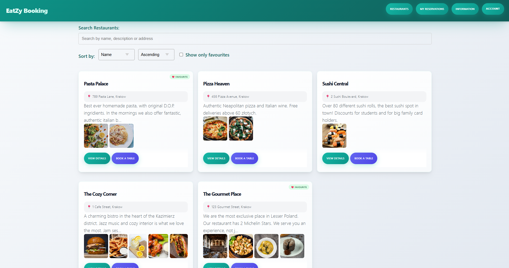
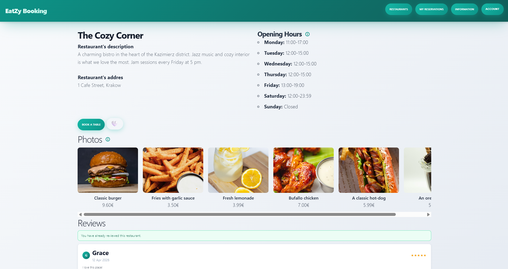

# Restaurant table booking app - EatZyBooking

EatZyBooking is a web application based on a simple table booking system. It allows its users to register either as a restaurant owner or a customer. Owners can showcase their restaurants on the site, allowing customers to book tables at them. The application is built with Laravel PHP framework, also utilizing Tailwind, PostgreSQL and Docker.

*Example screenshots of the application's main pages*

## Features

The application includes many features, allowing users to do things such as:

- filter and search through reataurants and bookings,
- manage bookings,
- receive notifications,
- edit their user profile,
- enable two factor authentication,
- recover their password,
- review restaurants (customer only),
- reply to reviews (owner only),
- create and edit restaurant profiles (owner only),
- block users (admin only).

*Some of the features showcased from a customer's view*

## Booking system description

The application allows users to create either a customer or an owner account. Owners can post their restaurants on the site, allowing the customers to book tables at them. Customers' booking requests can be accepted or refused by the restaurant owners.
The application's main page is the restaurant browsing page. There the guest users and the customers can search for and filter through available restaurants. Customers can choose to book a table at any of those. If they do so, their reservation appears as pending in their reservation browsing page. The owner of the restaurant can then either accept or deny the request in their reservation page.

Site showcased from a restaurant owner's view:

## Project structure and design

### Technologies used

**The project is built with Laravel (PHP) and uses Blade as the templating engine.**

Frontend technologies:

- HTML
- CSS (Tailwind CSS)
- JavaScript

**The project uses Docker to run all required services in isolated containers:**

- Laravel application (PHP + Nginx)
- PostgreSQL database
- pgAdmin

### Implementation

##### The application follows the MVC pattern.

- Models represent database entities and business logic
- Controllers handle HTTP requests and application flow
- Blade views handle presentation layer.

##### A big focus was put on enforcing the business and authorization rules.

- The middleware and policies ensure proper authorization and access.
- The controllers, the views and the database rules, triggers and functions guarantee that business rules will be expected.

##### Used libraries

- Two factor authentication uses [Google2FA](https://github.com/antonioribeiro/google2fa) library
- QR code generation is done with [BaconQrCode](https://github.com/Bacon/BaconQrCode) library
- Mail system is using [Resend Laravel](https://resend.com/laravel)

Example of the two factor authentication feature use:

## Running the application

In the project's directory:

docker compose up --build

**The app is running at:** [http://localhost:8001](http://localhost:8001)

**pgAdmin:** [http://localhost:4321/browser/](http://localhost:4321/browser/)

Host name: postgres

Port: 5432

Database: postgres

Username: postgres

Password: password

#### Access credentials

##### Example of a customer account:

Email: grace@email.com

Password: userpass

##### Example of an owner account:

Email: eve@cozy.com

Password: ownerpass

##### Example of an admin account: 

Email: admin@eatz.com

Password: adminpass